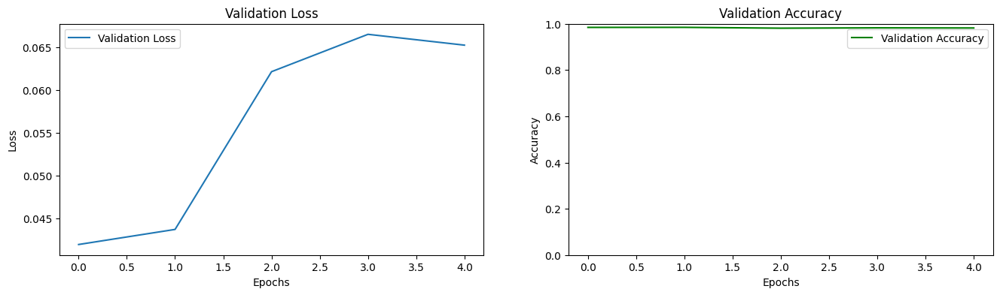

# Transfer Learning com ResNet50V2 - DIO

Este projeto é uma implementação de Transferência de Aprendizado utilizando o modelo **ResNet50V2** para classificar imagens de **gatos** e **cachorros**. A iniciativa faz parte de um estudo com a Digital Innovation One (DIO) e explora técnicas de aprendizado profundo.

---

## Teste o Notebook no Google Colab

Você pode abrir e executar este projeto diretamente no Google Colab clicando no botão abaixo:

[](https://colab.research.google.com/github/eunafita/transfer-learning-dio/blob/main/notebooks/transfer_Learning.ipynb)

---

## **Estrutura do Repositório**

- **`notebooks/`**
  - Contém o notebook Jupyter com o código de treinamento e avaliação do modelo: `transfer_Learning.ipynb`.
  
- **`images/`**
  - Imagens de teste para validação do modelo (`aisha.jpg` e `bob.jpg`).
  
- **`models/`** *(opcional)*
  - Modelos treinados salvos (se necessário para futuros carregamentos e inferências).

---

## Modelos Treinados

A pasta `models/` contém o arquivo do modelo treinado. Para executar o código, faça o download do modelo treinado no link abaixo e salve-o dentro da pasta `models/`.

[Baixar o modelo ResNet50V2](https://drive.google.com/uc?export=download&id=1XbwjGB1NsEEUmFG0WeGA7s22P0EBJnSd)

Depois de baixar, carregue o modelo no código com:

```python
from tensorflow.keras.models import load_model

model = load_model("models/resnet50v2_model.h5")
```

---

## **Dataset Utilizado**

Este projeto utiliza o dataset Cats vs Dogs, disponível publicamente no TensorFlow Datasets. Este conjunto de dados contém imagens rotuladas de gatos e cachorros, sendo amplamente utilizado para tarefas de classificação binária em visão computacional.

- Número de imagens: ~25.000.
- Classes: Gato e Cachorro.
- Origem: Publicado originalmente como parte do Kaggle's Dogs vs. Cats competition.

O dataset é carregado automaticamente pelo TensorFlow ao executar o código, portanto não é necessário baixá-lo manualmente.

---

## **Principais Funcionalidades**
- Pré-processamento de imagens para uso com o modelo ResNet50V2.
- Treinamento do modelo com Transfer Learning, usando o dataset de gatos e cachorros.
- Visualização do desempenho do modelo (gráficos de perda e acurácia).
- Classificação de novas imagens fornecidas pelo usuário.

---

## **Resultados do Treinamento**

O modelo foi treinado por 5 épocas, com os seguintes resultados:

| Época | Acurácia (treino) | Perda (treino) | Acurácia (validação) | Perda (validação) |
|-------|-------------------|----------------|----------------------|-------------------|
| 1     | 97.13%           | 0.0755         | 98.45%              | 0.0420           |
| 2     | 98.89%           | 0.0299         | 98.47%              | 0.0438           |
| 3     | 99.47%           | 0.0184         | 98.11%              | 0.0622           |
| 4     | 99.57%           | 0.0145         | 98.26%              | 0.0665           |
| 5     | 99.69%           | 0.0111         | 98.19%              | 0.0653           |


Gráficos de desempenho foram gerados para acompanhar a evolução da perda e acurácia durante o treinamento:

### Gráfico de Perda (Loss) e Acurácia (Accuracy)


---

## **Requisitos**

Certifique-se de que você tem as seguintes dependências instaladas:

- Python 3.x
- TensorFlow
- NumPy
- Matplotlib
- Pillow

Para instalar, execute:

```bash
pip install tensorflow numpy matplotlib pillow
```

---

## **Como Usar**

## 1. Clonar o Repositório

Clone o projeto para sua máquina local:

```bash
git clone https://github.com/eunafita/transfer-learning-dio.git
```

## 2. Estrutura do Projeto

Certifique-se de que a estrutura esteja semelhante a esta:

```arduino
transfer-learning-dio/
├── notebooks/
│   └── transfer_Learning.ipynb
├── images/
│   ├── aisha.jpg
│   └── bob.jpg
├── models/
├── data/
└── README.md
```

# **3. Executar o Notebook**

1. Abra o arquivo notebooks/transfer_Learning.ipynb no Jupyter Notebook ou Google Colab.
1. Siga as instruções do notebook para:
Treinar o modelo com Transfer Learning.
Fazer previsões com novas imagens.

---

## **Exemplo de Uso**

No notebook, você pode testar imagens fornecendo o caminho para o arquivo de imagem. Por exemplo:

```python
# Caminho para a imagem externa
image_path = "./images/aisha.jpg"

# Fazer a previsão
predicted_class = "Gato" if predicted_prob > 0.5 else "Cachorro"
print(f"Predição: {predicted_class}")
```

Resultado esperado:
Para aisha.jpg (cachorro), o modelo deve retornar "Cachorro".
Para bob.jpg (gato), o modelo deve retornar "Gato".

---

## **Customizações Futuras**

Adicionar mais classes ao modelo.
Implementar uma interface gráfica para upload de imagens.
Salvar o modelo treinado e disponibilizar para uso em produção.

## **Autor**

Este projeto foi desenvolvido por Rafael Danilo Santos Bortoluzzi.

Se você gostou deste projeto, não esqueça de deixar uma ⭐ no repositório!


